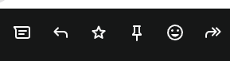

:adp_meta_uid: 11111111
include::../../.adp/start.adoc[]
= Mon premier fichier !

== Mon premier test !

qsdf qdfqsf qsedfqs dfqsd
--
qsdfqs dfqsdf qs

bloc ouvert
--

##[DEBUG] ``docinfodir`` : {docinfodir}##

ifdef::data-uri[]
data uri est défini !!
endif::data-uri[]

##[DEBUG] ``pdf-themesdir`` : {pdf-themesdir}##

##[DEBUG] ``pdf-theme`` : {pdf-theme}##

ifeval::[{_show_todo}==1]
[.todo]
****
*Tâches à faire*

* problème de rendu du compteur de question
* créer les attributs pour le thème défini au niveau du projet puis au niveau du document
* gérer le chargement du thème en fonction du contexte (document, projet, système)
* gérer la génération des images utilisée dans le css en base 64

//end todo
****
//end eval _show_todo
endif::[]

// toc::[]

[plantuml,target=puml_023e5eec, subs="attributes"]
....
hide circle
skinparam classAttributeIconSize 0
skinparam classFontStyle bold
skinparam classBackgroundColor #E0F2FE/#7DD3FC

class Voiture{
 - couleur: String
}

....

Menu Projet

Il doit être possible de quitter via le menu Projet > quitter.
Certaines actions doivent être prévues sur le document ouvert (enregistrement auto, mise à jour diverses en bdd, index, nettoyage des éléments inutiles, etc)

Menu "Document"

*Création d'un document*

L'utilisateur clique le menu "document" puis sur créer un nouveau document

On choisit le répertoire dans lequel créer le document (on peut créer un nouveau dossier dans le répertoire), mais il ne doit pas être possible de créer un document en dehors du projet courant.

Il y a plusieurs types de document : ``chapter``, ``exercise``, ``evaluation`` (liste pouvant s'étoffer dans l'avenir).

Un "document" est un dossier qui contient :

* un fichier ``main.adoc`` (c'est le fichier principal)
* des sous-dossiers (au minimum ``images`` et ``extras``) (l'utilisateur doit pouvoir configurer une liste de dossier à créer automatiquement).

Voici un exemple d'un dossier nommé chap1.
----
└───chap1
    │   main.adoc
    │
    ├───extras
    │       ressource.pdf
    │
    └───images
            test.png
----

Le nom du dossier de document est l'équivalent du nom de fichier word en réalité. Comme le framework impose la création d'un fichier main.adoc, c'est la seule possibilité d'avoir visuellement la signification du dossier.

Donc l'utilisateur doit définir le nom du dossier qui va contenir les fichiers composant son document puis définir le titre. (on pourrait proposer de définir le nom du dossier à partir  du titre mais les articles "les", "le" fausse le tri je trouve, donc il faut indiquer que le dossier par défaut aura le titre du document mais que cela est modifiable). L'utilisateur valide.
Imagine l'utilisateur qui créer un document dans le dossier chap1 avec le titre "Asciidocpro nouvelle génération", le fichier main.adoc contient alors
----
//L'uid ne doit JAMAIS être modifié.
:_meta_uid: 0b02400f94
[[doc_0b02400f94]]
[reftext="asciidocpro_nouvelle_generation"]
= Asciidocpro nouvelle génération
\include::../../.adp/start.adoc[]
----

Le document est chargé automatiquement dans la zone d'édition.

*Ouvrir un document*

L'utilisateur clique sur Document > ouvrir,
il voit la liste des documents récents et peut rechercher un document.
Il sélectionne le document et l'ouvre (il lui est demandé s'il veut l'ouvrir dans la présente fenêtre ou dans une nouvelle fenêtre). dans le premier cas, le contenu de la zone d'édition est remplacé par le nouveau, dans le second cas , une fene^tre identique à la présente fenêtre s'ouvre avec le document à éditer.

Si un document est déjà ouvert, il ne doit pas être ouvert une seconde fois. sa fenêtre sera mis au premier plan.

*Fermer un document*

Un document peut être fermé en faisant Document > Fermer. Dans ce cas la zone d'édition est vidée.
Certaines actions doivent être prévues sur le document ouvert (enregistrement auto, mise à jour diverses en bdd, index, nettoyage des éléments inutiles, etc)

Il y aura d'autres éléments au menu mais pour l'instant, ce sont les deux éléments de base.

Pour configurer un projet, cela revient à renseigner des valeurs qui vont être associés à des attributs écrits dans le fichier d'attributs situé dans appdata.
Il s'agit de l'auteur, de son mail et des différentes options de rendu:
affichage des réponses par défaut, des todo, des notes, etc. par défaut, le fichier des attributs du projet sera le reflet des attributs défini par le framework. et l'utilisateur pourra les modifier ce qui mettra à jour

.Belle image

##[DEBUG] ``adp_project_user_attributes_file`` : {adp_project_user_attributes_file}##

//❓❓❓ Question ---------------------------------------------------
[.question]
**********
include::{adp_label_question}[]

qsdfqsd fqsdfqsdfqsdf
**********
//❓ -----------------------------------------------------------------

//🔶🔶🔶 Réponse ---------------------------------------------------
ifeval::[{adp_show_correction} == 1]
[.answer]
**********
include::{adp_label_answer}[]

ta réponse
**********
endif::[]
include::{adp_label_answer_hidden}[]
//🔶 -----------------------------------------------------------------

Ceci est une vraie phrase qui va permettre de se rendre compte de la fatigue de lecture sur des lignes qui sont longues.
Ceci est une vraie phrase qui va permettre de se rendre compte de la fatigue de lecture sur des lignes qui sont longues.
Ceci est une vraie phrase qui va permettre de se rendre compte de la fatigue de lecture sur des lignes qui sont longues.

[.keyword]#nouveau mot clé#(((nouveau mot clé)))

//❓❓❓ Question ---------------------------------------------------
[.question]
**********
include::{adp_label_question}[]

question sans réponse
**********
//❓ -----------------------------------------------------------------

//❓❓❓ Question ---------------------------------------------------
[.question]
**********
include::{adp_label_question}[]

autre question mais avec réponse
**********
//❓ -----------------------------------------------------------------

//🔶🔶🔶 Réponse ---------------------------------------------------
ifeval::[{adp_show_correction} == 1]
[.answer]
**********
include::{adp_label_answer}[]

réponse ! !!
**********
endif::[]
include::{adp_label_answer_hidden}[]
//🔶 -----------------------------------------------------------------

voici le mot [.keyword]#toto#(((toto)))

boici la variable ``qsdfqsdf qsdf qsdfs``

cliquer sur https://docs.asciidoctor.org/asciidoc/latest/sections/id-prefix-and-separator/[www.google.fr] qsdf qsdfq sdf qsdf qsdfqsdfaze fqsdd fdf qsdf qsdf qdsf qsd fq sd qs qs d fqsdf qsdf qs dfqsddf qsdf qsdf qsd fqsdfqsd qsdf sqdfqs qs qzssdfq sdfqsdfqsdf qsdf

##[DEBUG] ``adp_image_logo_icon_asciidocpro_file`` : {adp_image_logo_icon_asciidocpro_file}##

.[.uid]# 4b52077b36 #
[%header,cols="1a,1a", stripes=even]
|===
^.^| qsdfqsf
^.^| qsdfqsdf
// -------------td2----------------
| qsdfqsdfqsf
| qsdfqsdf
// -------------td2----------------
|sdfqsdf qsd fqsdf qsdfqsdfqsd f
|sdfqsdf qsd fqsdf qsdfqsdfqsd f
// -------------td2----------------
|sdfqsdf qsd fqsdf qsdfqsdfqsd f
[.keyword]#toto#(((toto)))
|sdfqsdf qsd fqsdf qsdfqsdfqsd f
// -------------td2----------------
| sdfqsdf qsd fqsdf qsdfqsdfqsd f
|sdfqsdf qsd fqsdf qsdfqsdfqsd f
|===

ifeval::[{adp_show_todo}==1]
[.todo]
****
include::{adp_label_todo}[]

{author}
****
endif::[]

[.keyword]#piste#(((piste)))

== Test des caractères Unicode

=== Caractères français courants
é è ê ë à â ù û ü ô î ï ç œ æ

=== Symboles mathématiques
∑ ∫ ∂ ∞ √ ≠ ≤ ≥ ± × ÷ π

=== Flèches
→ ← ↑ ↓ ↔ ⇒ ⇐ ⇔

=== Symboles divers
© ® ™ € £ ¥ § ¶ † ‡

=== Caractères asiatiques (test fallback)
日本語 中文 한국어

=== Émojis
✓ ✗ ★ ☆ ♠ ♣ ♥ ♦

== premier titre

.[.uid]# e0d51f8567 # extrait
[source,java, subs="attributes+",indent=0]
----
class test {
private String name;
}
----

.mon test
====
qsdfqsdfqsdf
====

##[DEBUG] ``pdf-theme`` : {pdf-theme}##

ceci est ``du monospace`` mais c'est trop clair

== second titre

=== trois

==== quatre

===== cinq

====== six

======= sept

##[DEBUG] ``adp_project_appdata_folder`` : {adp_project_appdata_folder}##

.[.uid]# 5b2c1da862 # 
[%header,cols="1a,1a", stripes=even]
|===
^.^| qsdfqsdfqsdfqsdfs
^.^| 
// -------------td2----------------
| 
| 
|===

====
qsdfqsdfqsdf
====

.titre
====
example
====

.Titre optionnel
[source,java]
----
public class Hello {
    public static void main(String[] args) {
        System.out.println("Hello");
    }
}
----

//❓❓❓ Question ---------------------------------------------------
[.question]
**********
include::{adp_label_question}[]
Ceci est une question
**********
//❓ -----------------------------------------------------------------

##[DEBUG] ``adp_project_code_number`` : {adp_project_code_number}##

//🔶🔶🔶 Réponse ---------------------------------------------------
ifeval::[{adp_show_correction} == 1]
[.answer]
**********
include::{adp_label_answer}[]

**********
endif::[]
include::{adp_label_answer_hidden}[]
//🔶 -----------------------------------------------------------------

qsdfqsdfqsdfqsdfqs  QSDQs dqd

ifdef::backend-html5[]
aaaa aaaa a

[.notable]#qsd qsdf sqdfqsdfqs qsdfqsdf# qsd qs qs
endif::backend-html5[]

ifdef::backend-pdf[]
$END$
endif::backend-pdf[]

[.notable]#Cic qmsdlk fqmslkx vqsdjkl fqsljdnv mlqj sdnmclkqsd nqsmdlkvjn mosdln#
[.notable]#Cic qmsdlk fqmslkx vqsdjkl fqsljdnv mlqj sdnmclkqsd nqsmdlkvjn mosdln#
[.notable]#Cic qmsdlk fqmslkx vqsdjkl fqsljdnv mlqj sdnmclkqsd nqsmdlkvjn mosdln#
[.notable]#Cic qmsdlk fqmslkx vqsdjkl fqsljdnv mlqj sdnmclkqsd nqsmdlkvjn mosdln#
[.notable]#Cic qmsdlk fqmslkx vqsdjkl fqsljdnv mlqj sdnmclkqsd nqsmdlkvjn mosdln#
[.notable]#Cic qmsdlk fqmslkx vqsdjkl fqsljdnv mlqj sdnmclkqsd nqsmdlkvjn mosdln#

//❓❓❓ Question ---------------------------------------------------
[.question]
**********
include::{adp_label_question}[]

qsdfqsdf qsdfq
**********
//❓ -----------------------------------------------------------------

//🔶🔶🔶 Réponse ---------------------------------------------------
ifeval::[{adp_show_correction} == 1]
[.answer]
**********
include::{adp_label_answer}[]

qsdfqsdfqsdfqsdf
**********
endif::[]
include::{adp_label_answer_hidden}[]
//🔶 -----------------------------------------------------------------

//🅿️🅿️🅿️ Note du professeur
ifeval::[{adp_show_teacher_note} == 1]
[.teacher_note]
*********
include::{adp_label_teacher_note}[]

*********
endif::[]
//🅿️

//🅿️🅿️🅿️ Note du professeur
ifeval::[{adp_show_teacher_note} == 1]
[.teacher_note]
*********
include::{adp_label_teacher_note}[]

*********
endif::[]
//🅿️

Ceci est ((mot clé)) pour ici!

Ceci est un [.keyword]#mot clé#(((mot clé)))

ifeval::[{adp_show_todo}==1]
[.todo]
****
include::{adp_label_todo}[]

****
endif::[]

ifeval::[{adp_show_todo}==1]
[.todo]
****
include::{adp_label_todo}[]

qsdfqsdfqsdfqsdfqsqsdf
****
endif::[]

